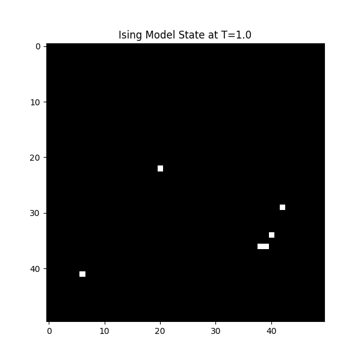

# 2D Ising Model Simulation via Metropolis Algorithm

## Overview
統計力学における2次元イジングモデル（磁性体）の相転移現象を、モンテカルロ法（メトロポリス法）を用いてPythonでシミュレーションしたプロジェクト。
温度 $T$ の変化による「秩序相」から「無秩序相」への転移、および臨界点付近での「臨界ゆらぎ」の可視化を目的とする。

## Features
- **Fast Calculation**: Numba (`@jit`) による高速化実装。
- **Visualization**: スピン配置のリアルタイム可視化。

## Environment
- Python 3.13.6
- NumPy
- Numba
- Matplotlib

## Results

### 1. Ordered Phase (Low Temperature: T=1.0)
エネルギー最小化が支配的となり、スピンが整列している（強磁性状態）。


### 2. Critical Fluctuation (Critical Point: T=2.3)
相転移点付近。自己相似的な「ゆらぎ」が観測された。


## Usage
```bash
# Install dependencies
pip install numpy matplotlib numba

# Run the notebook
jupyter lab Ising_Model.ipynb